# 第一次课

## 1.目标

- 真实、上线的应用

- 有用户

- 后端、数据库、JS

- web应用开发、团队开发工具、web应用安全与性能优化

通过长按、拖动等便捷操作，自动截图？识别链接？使得便捷汇总，实现多平台汇总。

通过输入症状匹配可能疾病，得到所需营养物质和食品甚至菜品，实现便利科学养生。

需求：随着科学知识的普及，很多人养生更注重养生原理，从营养成分出发更有可信度。

- 减肥 高纤维低热量易饱腹 红薯、玉米
- 增肌 高蛋白低热量 鸡肉、牛肉
- 眼干 胡萝卜素 胡萝卜、西兰花
- 长高 补钙 深绿色蔬菜

功能：症状匹配所需营养物质、食物甚至菜品，食物或照片匹配病状，自动制定健康计划，提供社区服务，并执行激励措施。

实现：给常见病状设置可能的关键词，关键词设置对应营养物质，食物设置关键词，菜品设置食物。给出科普度颜色条。

# 一、小程序布局

## 1.文件配置

- 删除所有文件，只剩pages和三个app和两个项目文件。
- 删除app.json中的pages内容，和app.wxss内容。
- 在pages目录新建home目录，在home目录新建home的page（app.json中pages出现新page内容）。
- 在根目录新建images目录，存入图片。
- 在home目录的home.wxml写入内容。

## 2.基础知识

- WWW：浏览器向服务器发送HTTP请求，服务器将结果以HTML格式返回。
- 屏幕宽度：750rpx。

## 3.CSS基础

- 选择器、声明、属性、属性值。

- 方式：内联、外接

- height：长度、百分数（父元素高度确定）、auto。

- padding：上右下左；百分数相对于父容器宽度。

- border：粗细、样式、颜色。

- margin：

  - margin collapse：垂直方向两个div的margin取较大值，水平不取。
  - 可取负值。

- box-sizing：height和width为box大小（原为content大小），可以用height和width固定盒子大小（需要调整padding时）。

- overflow：控制内容溢出盒子时的显示，visible，hidden，scroll。

- min-width, max-width：改动大小时，设置最小最大。

- 块级、行级：行级width和height不适用

  - 块级，display: block
  - 行级，display: inline
  - display: inline-block，行级可调整width和height（变成盒子）
  - display: none，不显示

- 盒子其他样式：

  - border-radius: 左上 右上 左下 右下；水平/垂直
  - background：
    - -color 
    - -image 
    - -repeat（: no-repeat, repeat, repeat-x, repeat-y） 
    - -position: center; 20px 20px
    - -size: contain; cover
    - clip

  - box-shadow: 1px 1px 8px 0 grey 设置阴影

- 浮动：盒子中，行级+盒子，行级使用浮动时，行级**脱离常规流**，盒子里文字绕开行级元素排列；浮动依次向右排列。
  - float: left
  - clear: both，取消浮动，正常换行排列。

- 定位：
  - position：
    - static
    - relative
    - absolute
    - fixed

- 字体
  - font-family，英文放在中文前面
  - font-size：关键字、大小、百分数
  - font-style：斜体等
  - font-weight：粗细，400-nomal，700-bold
  - line-height：大小、倍数。行高
  - font: style weight size/height family

- 文字
  - text-align: left, center, right, justify（分散对齐）
  - letter-spacing/word-spacing: 5px
  - text-indent：设置缩进
  - text-decoration：下划线等
  - white-space: pre，不强制合并空格
  - text-shadow: color offset-x offset-y blur-radius

## 4.CSS总结

- 一级盒子：给出必要的margin、padding；布局flex。
- 二级盒子（需要横向对齐排列）：设置宽高或使用float。
- 三级盒子：设置高（纵向对齐排列）/设置宽高（横向对其排列）

## 5.总结

- 配置好文件目录
- 写好html和css文件
- 上传→网页版本管理→开发版本→提交审核→审核完成，发布。

# 二、flex布局

## 1.CSS横向布局

- inline-block
- float: left
- display: flex
  - 子级高度变为父级，改变宽度同行排列，直到溢出，margin, padding仍生效。
  - flex-wrap: wrap，保持宽度，溢出**换行**
  - flex-direction，**子级排列方式**
    - row，父级左上角向右排列
    - row-reverse，父级右上角向左排列
    - column，父级左上角向下排列
    - column-reverse，父级左下角向上排列
  - justify-content，**主轴对齐方式**
    - flex-start（默认值）：左对齐
    - flex-end：右对齐
    - center： 居中
    - space-between：两端对齐，项目之间的间隔都相等。
    - space-around：每个项目两侧的间隔相等。所以，项目之间的间隔比项目与边框的间隔大一倍。
  - align-items，**交叉轴对齐方式**
    - flex-start：交叉轴的起点对齐。
    - flex-end：交叉轴的终点对齐。
    - center：交叉轴的中点对齐。
    - baseline: 项目的第一行文字的基线对齐。
    - stretch（默认值）：如果项目未设置高度或设为auto，将占满整个容器的高度。
  - flex-grow，随着屏幕的宽度调整至父级边界（微信输入框）
  - order，定义项目的排列顺序

## 2.添加小程序tabbar

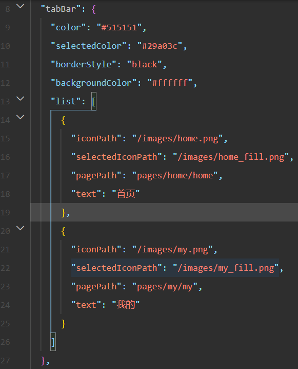

## 3.实现跳转

- <navigator url="">包围元素（包含参数，定位点击的图标）
- js文件onload中的options为此参数
- 数据绑定
  - home里对各图标标号（wxml中用navigator链接页面和id，js中用数组设置data的id），点击图标时，跳转到对应页面有id

## 4.总结

- 写好html和css
  - 重复格子布局：写好一个格子，在js中写入数组所有属性，在wxml中用block循环。
- 添加更多tabbar，链接到更多page

# 三、后端

## 1.获取用户登录数据

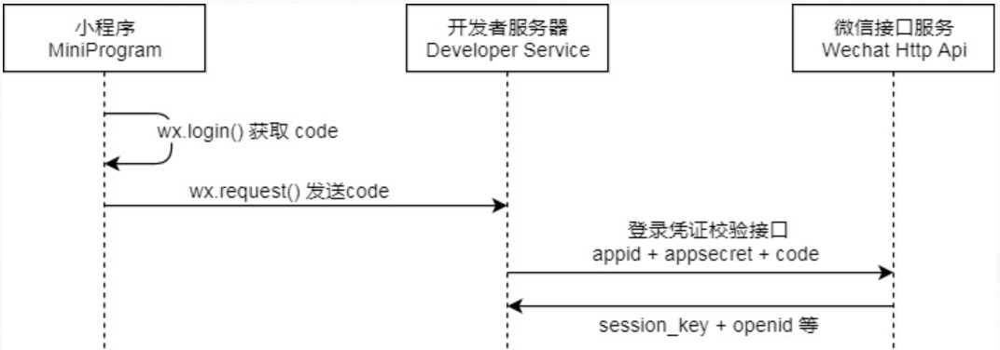

- 在login中写入函数：登录获取用户code，发送到服务器处理，服务器将三者发送到微信端，微信端返回真实数据到服务器。（最终服务器获得用户openid）

- 不使用https时

  - 勾选小程序中的不校验
  - login中写入访问服务器的函数

  - 本地写好index.js文件
    - 获取code，写入appid、appsecret
    - appsecret：2cdc643936e6d8a8fca0fc44cd950dc2
    - 发送并返回openid
  - 利用gitee上传到服务器/opt/0330/mpcourse/目录
    - 本地创建gitee仓库并关联到gitee，服务器配置git环境并将gitee克隆下来，在webstorm编辑文件并push到gitee，在服务器pull下来。
  - 启动index.js，刷新小程序页面，即出现openid

- 使用https时

  - 申请https：解析域名，买ssl证书，证书绑定域名（dns验证），下载证书，用scp将两个文件部署到服务器，服务器开启https端口443。

  - 不勾选小程序中的不校验

  - login中写入访问服务器（https）的函数

    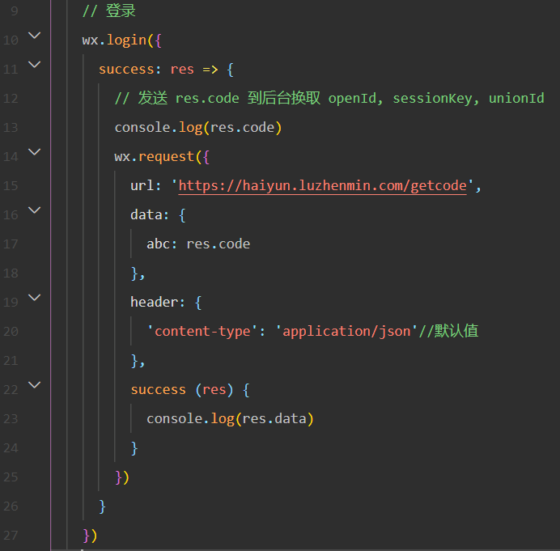

  - 域名添加到小程序后台

  - 本地修改index.js文件，补充https协议内容

    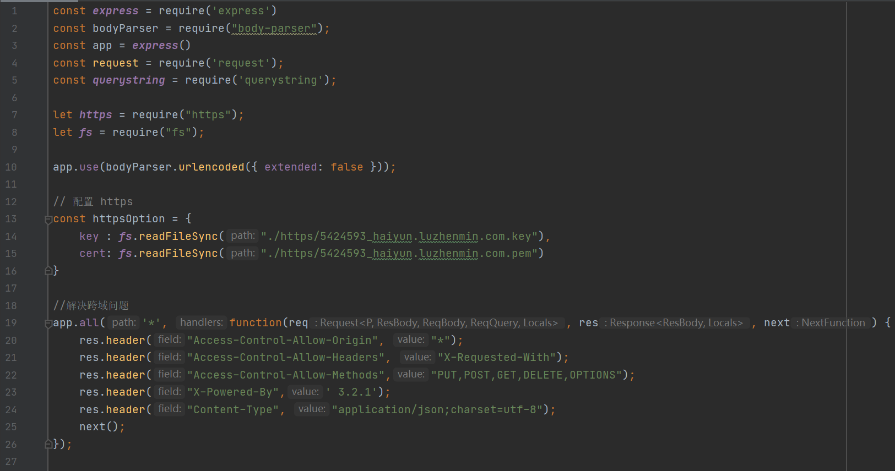

    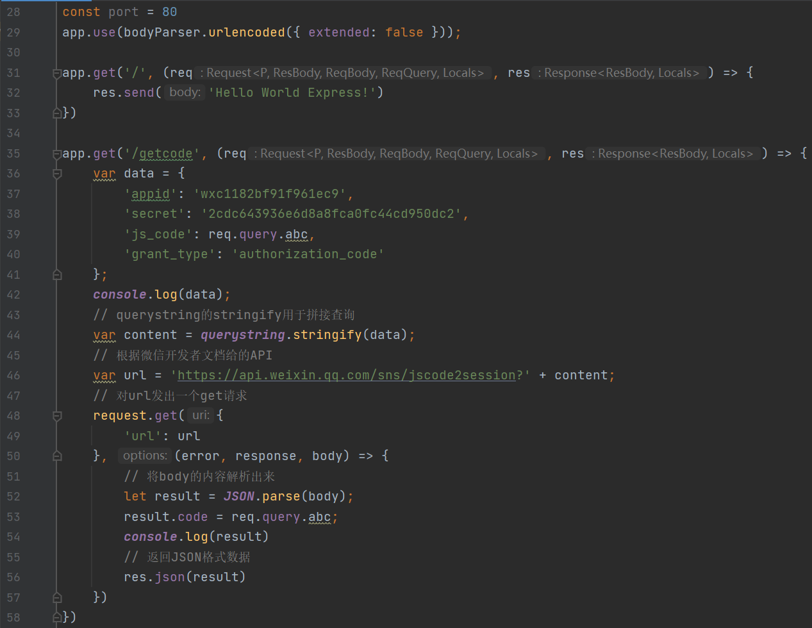

    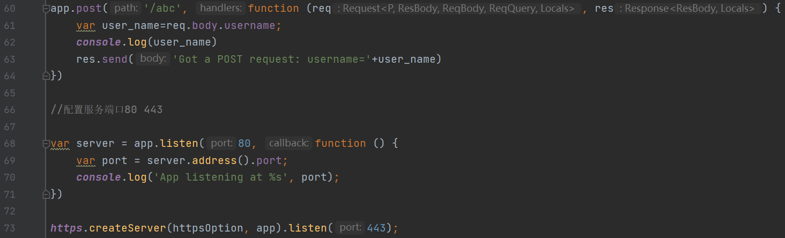

  - index.js上传到服务器并启动，刷新小程序页面，即出现openid

## 2.数据库修改data

- 在onload中写入函数：加载时访问服务器，服务器访问数据库赋值到data，再返回到小程序。

  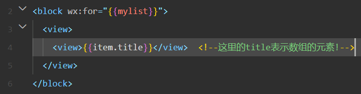

  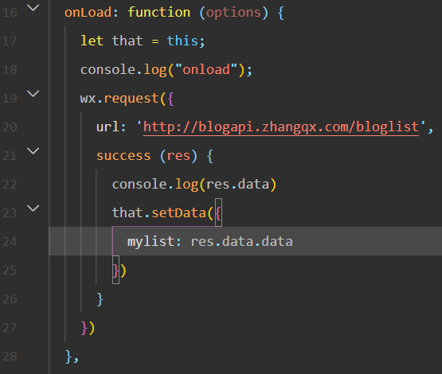

## 3.总结

- 小程序登录时获取code并访问服务器
- 服务器将code、appid、appsecret发送到微信端并返回openid等
- 服务器通过openid获取用户信息，访问数据库，更新小程序

# 四、数据库

## 1.将openid存入数据库

- 小程序端不变（post方法）

  - post方法中为req.body.code，get方法中为req.query.code

- 改进index.js文件，增加数据库池

  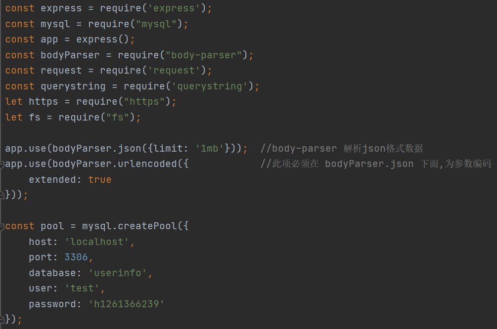

- 池连接数据库，有openid则执行查询语句，返回表中的id到userid变量中，返回到result，没有则执行插入语句，返回插入的id到userid变量中，返回到result。

  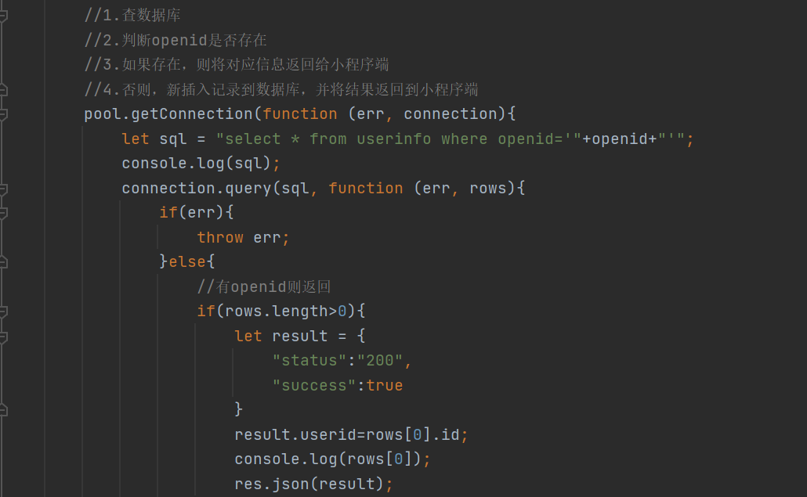

  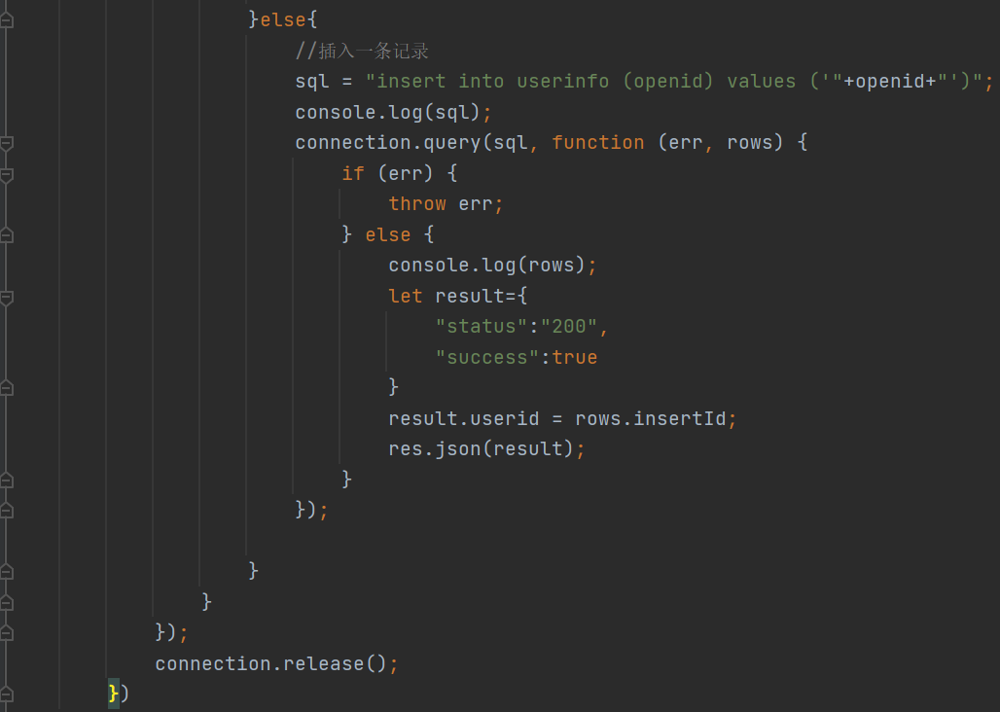

- 小程序端可见result，数据库可见插入记录

- 登录，发送code，openid到服务器，数据库有信息则匹配id，没有则新建并返回用户id

## 2.home页面加载

- 目标：
  - 获取swiper，文章信息
  - 查swiper的img，查knowledge左连接fondCollect的所有（null填为0）
- 小程序端：
  - data：swiper[]，knowledge[]
  - 访问，输出swiper[]，knowledge[]，wx: if取knowledge[0].fond和.collect判断并显示状态
  - 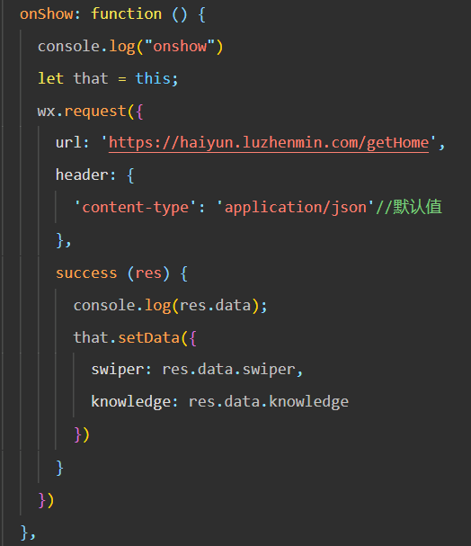
- 服务器端：
  - 数据库：swiper，knowledge
  - 查询，输出swiper，knowledge
  - 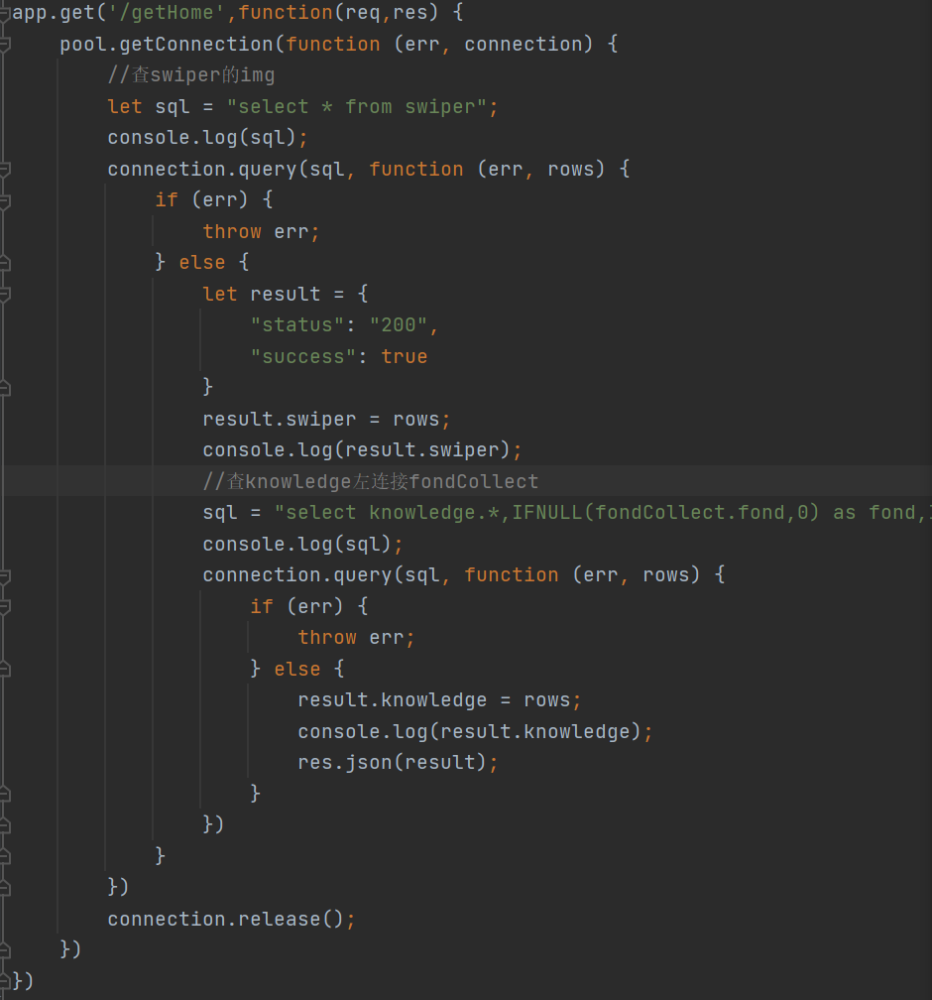

## 3.跳转knowledge页面加载

- 目标：
  - 获取指定id文章信息
  - 改knowledge中view_num+1，查knowledge左连接fondCollect的所有（指定uid，kid，null填为0）
- 小程序端：
  - data：knowledge[]
  - uid，kid访问，输出knowledge[]，wx: if取knowledge[0].fond和.collect判断并显示状态
  - 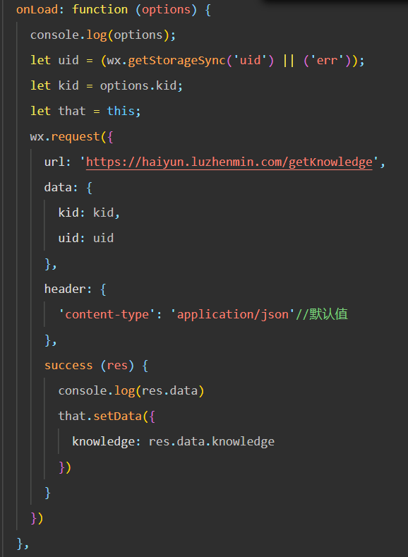
- 服务器端：
  - 数据库：knowledge，fondCollect
  - uid，kid查询，输出knowledge
  - 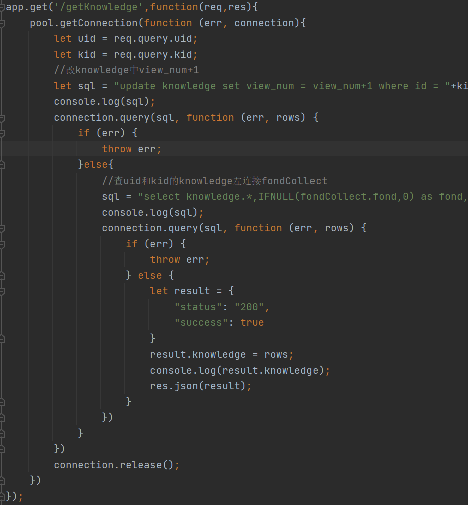

## 4.点赞、收藏响应

- 目标：

  - 点赞，指定个人及文章响应，获取文章点赞数量信息
  - 查fondCollect中uid和kid的fond（有则改，无则增），改fondCollect中uid，kid的fond，改knowledge的fond_num为fondCollect指定kid的fond总和，查uid和kid的knowledge左连接fondCollect

- 小程序端：

  - data：knowledge[]

  - uid，kid，fond访问，输出knowledge[]，wx: if取knowledge[0].fond和.collect判断并显示状态

  - 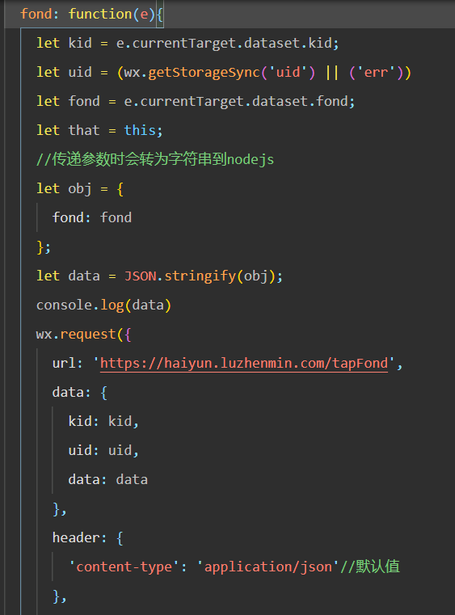

    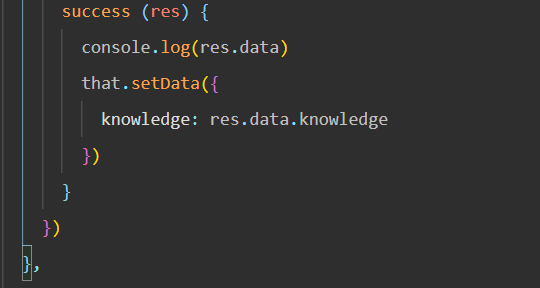

- 服务器端：

  - 数据库：knowledge，fondCollect

  - uid，kid，fond查询，输出knowledge

  - 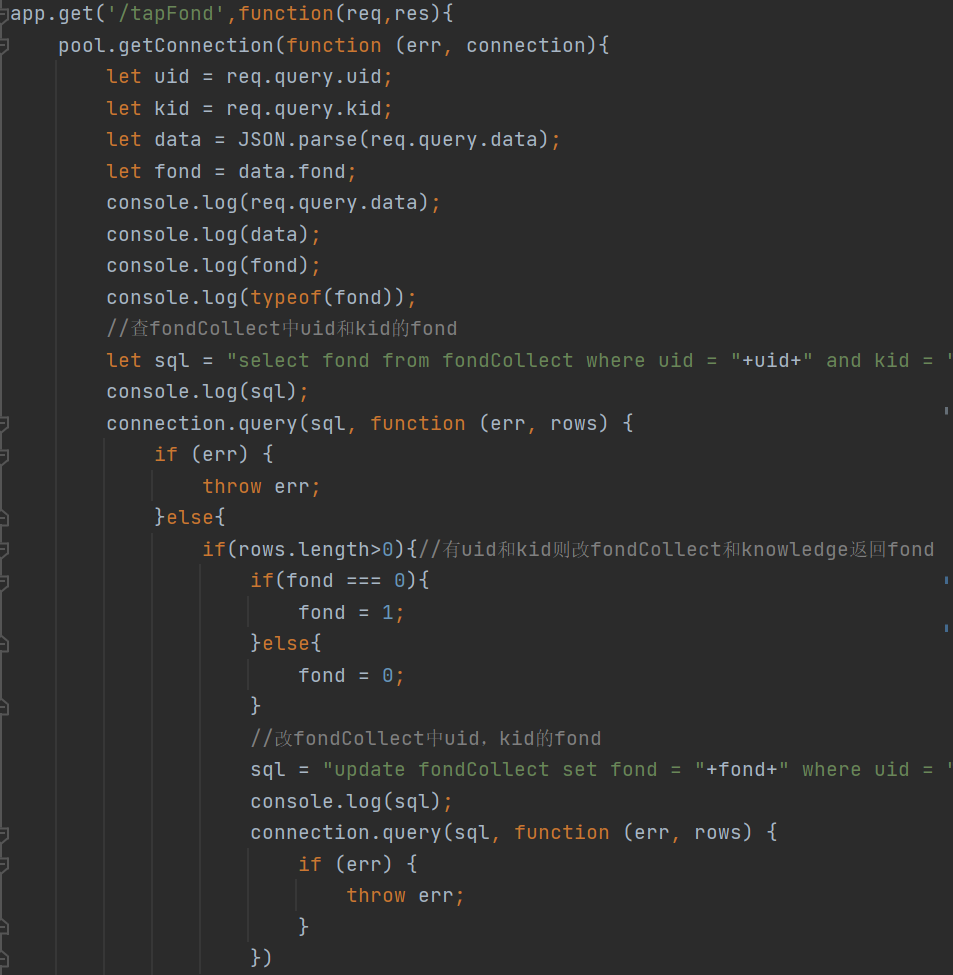

    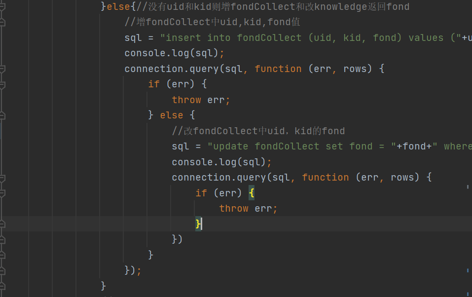

    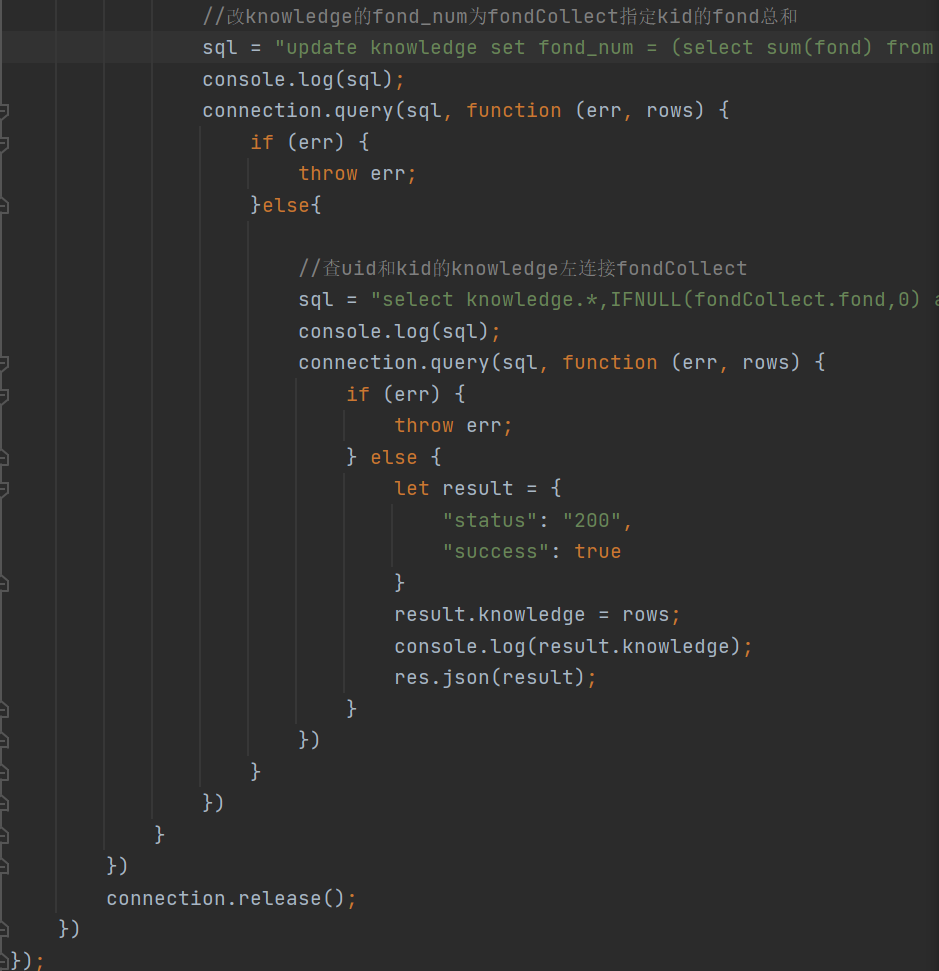

    

